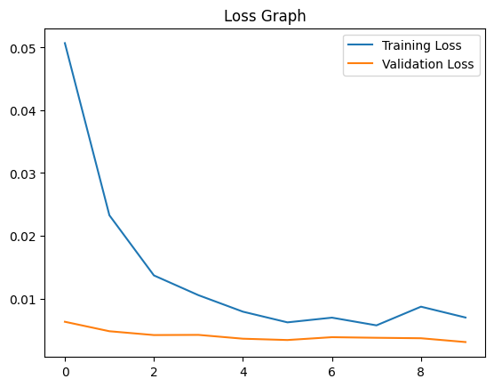
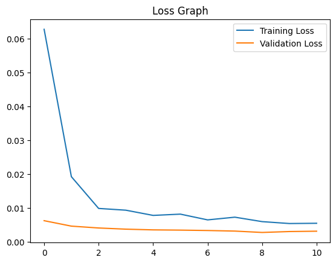
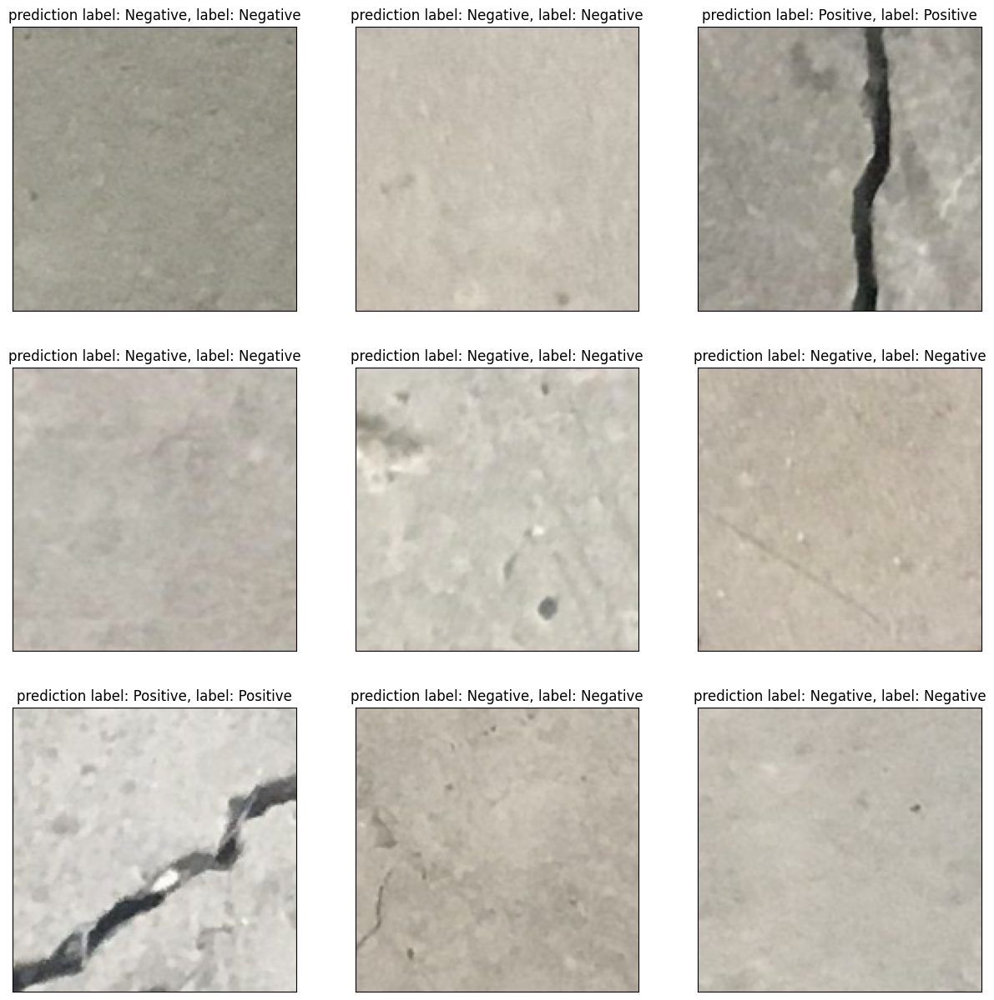

# **Concrete Crack Detection using Deep Learning**  

## **Project Overview**  
Cracks in concrete structures can compromise the safety and durability of buildings. This project aims to develop an AI model for classifying concrete images as either **cracked** or **non-cracked** using deep learning techniques. The developed model could help in early detection and prevention of structural failures.  

## **Dataset**  
- The dataset used for training and evaluation is available at:  
  [Mendeley Data - Concrete Crack Images](https://data.mendeley.com/datasets/5y9wdsg2zt/2)  
- Since the dataset is large, it is **not included** in this repository. Please download it from the link above.  

## **Project Workflow**  
1. **Problem Formulation** - Understanding the impact of concrete cracks and defining the objective of image classification.  
2. **Data Preparation** - Loading, cleaning, augmenting, and splitting data into training and testing sets.  
3. **Model Development** -  
   - Adapted **MobileNetV2** for transfer learning.  
   - Fine-tuned the model on the concrete crack dataset.  
   - Applied techniques to improve performance and generalization.  
4. **Model Training & Evaluation** -  
   - Ensuring accuracy **>90%**.  
   - Used **EarlyStopping** to prevent overfitting.  
   - Visualized training using **TensorBoard**.  
5. **Model Deployment** - Using the trained model included in the model folder to classify new concrete images.  

## **Folder Structure**  
```
📂 project-root/
│── 📂 dataset/           # Dataset folder (ignored in Git)
│── 📂 images/            # Contains model architecture, training process, results
│── 📂 logs/              # TensorBoard logs for training visualization (ignored in Git)
│── 📂 model/             # Saved trained model (.h5) and scalers (.pkl)
│── 📄 README.md          # Project documentation
│── 📄 requirements.txt   # Dependencies list
│── 📄 train.ipynb        # Initial training script (without EarlyStopping & TensorBoard)
│── 📄 train copy.ipynb   # Improved training script (with EarlyStopping & TensorBoard, Transfer Learning)
```

## **Installation & Setup**  
To set up the environment, install the required dependencies using:  
```bash
pip install -r requirements.txt
```

## **Training the Model**  
Run the Jupyter notebook:  

- **Without EarlyStopping & TensorBoard**  
  ```bash
  jupyter notebook train.ipynb
  ```
- **With EarlyStopping, TensorBoard & Transfer Learning (MobileNetV2)**  
  ```bash
  jupyter notebook "train copy.ipynb"
  ```

## **Model Architecture**  
- Used **MobileNetV2** as the base model for transfer learning.  
- Fine-tuned specific layers for better feature extraction.  
- Added custom **fully connected layers** for classification.  

## **Model Performance**  
- **Achieved Accuracy:** >90% (target)  
- **Loss & Accuracy plots**: Available in the `images/` folder  
- **Overfitting Prevention:**  
  - `train.ipynb`: No EarlyStopping  
  - `train copy.ipynb`: EarlyStopping + TensorBoard  

## **Model Architecture** 
- This the architecure for this model training


## **Model Performance** 
- Performance without early stopping  
  

- Performance with early stopping  
  

## **Prediction Based on Test Data** 
 

## **References**  
- **MobileNetV2 Paper:** [Link](https://arxiv.org/abs/1801.04381)  
- **Dataset Source:** [Mendeley Data](https://data.mendeley.com/datasets/5y9wdsg2zt/2)  
- **TensorFlow Documentation:** [tensorflow.org](https://www.tensorflow.org/)  